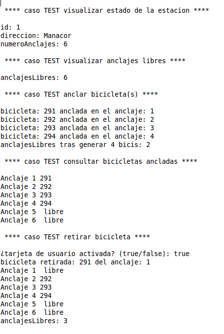

# BiciPalma

Este es un examen creado por [dfleta](https://github.com/dfleta).

Todo lo hecho en este código ha sido a partir del enunciado propuesto en el [repositorio original](https://github.com/dfleta/bicipalma).

Se proporcionan unas historias de usuario, un diagrama UML y el archivo main `App.java`. 

Además de lo mencionado anteriormente, también se entregó un documento con la descripción de los métodos más significativos del programa.

El propósito de este kata es obtener experiencia con:
- TDD
- DDD
- Interpretación de diagramas UML
- Principios SOLID
- POO
- Loops

Además de lo mencionado anteriormente, utilizo este kata para practicar streams.

## Historias de usuario

Las historias de usuario proporcionadas son las siguientes:

## Diagrama UML

El diagrama UML proporcionado por [dfleta](https://github.com/dfleta):

